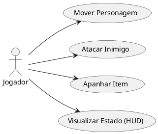
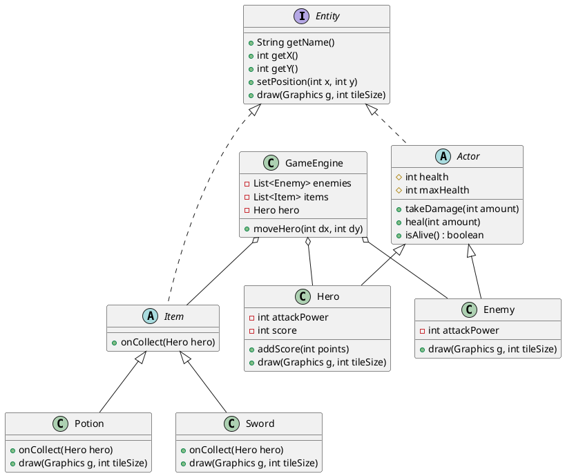

# Relatório de Projeto: JavaQuest - Explorando a Programação Orientada a Objetos

## 1. Introdução

Este relatório descreve o desenvolvimento do **JavaQuest**, um jogo bidimensional desenvolvido na linguagem Java. O objetivo principal deste projeto é aplicar e demonstrar, de forma prática e interativa, os quatro pilares fundamentais da Programação Orientada a Objetos (POO): **Encapsulamento**, **Herança**, **Polimorfismo** e **Abstração**. O jogo serve como uma ferramenta educativa para estudantes de programação, permitindo-lhes visualizar como estruturas conceptuais se traduzem em interações funcionais de software.

## 2. Análise de Contexto

No ensino da engenharia de software, conceitos abstratos como interfaces e polimorfismo são frequentemente percecionados como complexos por principiantes. O contexto deste trabalho advém da necessidade de criar um artifacto pedagógico que materialize esses conceitos num domínio aliciante para os alunos (o desenvolvimento de videojogos). O JavaQuest foi concebido para ser intencionalmente simples, operando via `Java Swing` para desenhar primitivas simples que demonstram as funções das várias instâncias gráficas, providenciando código muito direto de ler.

## 3. Requisitos

### Requisitos Funcionais
* O sistema deve permitir que o jogador assuma o papel de um "Herói" que se move numa grelha (Cima, Baixo, Esquerda, Direita).
* O sistema deve gerar "Inimigos" que o jogador consegue intercetar/atacar.
* O sistema deve dispor itens coletáveis pelos mapas ("Poções" e "Espadas") capazes de afetar os atributos (Saúde, Ataque) do jogador.
* O sistema deve manter registo da pontuação do jogador ao derrotar inimigos.
* O sistema deve apresentar mensagens de progresso na interface gráfica (HUD).
* O jogo deve terminar quando a vida do herói chega a 0, ou quando todos os inimigos falecerem.

### Requisitos Não-Funcionais
* O projeto deve aplicar os quatro pilares da POO (Abstração, Encapsulamento, Herança, Polimorfismo).
* O software deve ser compilável na versão base do Java (JDK 8 ou superior).
* O projeto deve focar a legibilidade do código-fonte e estar documentado (comentários em *JavaDoc* ou simples).

## 4. Diagramas de Casos de Uso

Para o desenho de diagramas de uma forma integrada ao código (fácil revisão no GitHub), recomendamos aos alunos que recorram ao formato **PlantUML**. Abaixo está a representação gráfica das ações possíveis pelo jogador:

A sintaxe de PlantUML é bastante intuitiva. O código que gerou o diagrama de casos de uso acima é o seguinte:

## 5. User Stories

1. **Como** estudante/jogador, **quero** mover o meu personagem pelas teclas WASD (ou setas) **para** explorar o mapa do jogo.
2. **Como** jogador, **quero** interagir com quadrados vermelhos (Inimigos) **para** entrar em combate e demonstrar comportamento da lógica do código.
3. **Como** jogador, **quero** apanhar espadas cinzentas ou círculos rosas (Poções) **para** aumentar os meus atributos de vida e ataque e conseguir derrotar o "Boss".
4. **Como** aluno a ler o código-fonte, **quero** que os Inimigos e o Herói herdem da mesma classe **para** que eu compreenda a partilha de comportamentos por *Herança*.

## 6. Análise de Domínio / Modelo Entidade-Relação

A análise base de domínio foca-se nas regras partilhadas de interações e na visualização lógica das interfaces base da Game Engine.

## 7. Análise da Estrutura do Projeto

O código do *JavaQuest* mapeia perfeitamente para os ensinamentos base de Programação Orientada a Objetos:

* **Abstração**: Empregue pelo uso da interface `Entity` e da classe abstrata `Item`. O sistema de jogo não tenta instanciar uma "Entidade" genérica e apenas aciona `Entity` para tratar desenhar todos os fragmentos no ecrã.
* **Encapsulamento**: Variáveis de estado críticas (como a `health` em `Actor` ou o `score` em `Hero`) são providas com os modificadores `protected` e `private`. O motor do jogo não manipula estas instâncias diretamente, invocando em alternativa os métodos `.takeDamage()` ou `.heal()` validando restrições automáticas sobre a vida (não deixando que ela ultrapasse a vida máxima ou vá a baixo de zero sem o exterior saber das equações para tal).
* **Herança**: Tanto `Hero` como `Enemy` herdam da classe abstrata base `Actor`. Assim, a lógica de atributos base (nome, posicionamento x/y, e vitalidade máxima vs vitalidade corrente) têm de ser codificadas e validadas uma única vez.
* **Polimorfismo**: Demonstrado fortemente no método `draw(Graphics g, int tileSize)`. Apesar do motor do jogo (em `GamePanel`) guardar uma lista contínua em `List<Item>` invocando em loop dinâmico o comando abstrato `.draw()`, as implementações concretas dos diferentes itens (`Potion` desenha-se como bola vermelha arredondada, `Sword` desenha uma haste cinza com guardas metálicas) sabem perfeitamente desenhar-se sem que a Game Engine preveja que geometria desenhar. Um caso idêntico aplica-se ao efeito de recolhimento dos mesmos num sobre-esrcito da chamada a `onCollect()`.

## 8. Apresentação do Projeto Final: "Screenshots" da UI

> *[Nota para o Aluno: Inserir aqui as capturas de ecrã tiradas ao rodar a app]*
> Imagem 1: Ecrã inicial com o Jogador, os Inimigos e itens pelo mapa.
> Imagem 2: Notificações do HUD ("Mensagem central de combates") durante uma colisão.
> Imagem 3: Ecrã de "Vitória" após exterminar o "Boss Singleton".

## 9. Conclusão Geral / Reflexão final

Através da construção do projeto **JavaQuest**, tornou-se evidente o poder de delegar responsabilidades base da renderização gráfica por via dos pilares da programação orientada a objetos (POO). A estrutura hierárquica forneceu flexibilidade de extensibilidade — se no futuro se desejar adicionar "Magos Inimigos" que atacarão de longe ou "Armaduras" como novo Item recolhível, as classes base como a interface genérica `Entity` não precisariam der ser alteradas, garantindo o "Princípio do Aberto/Fechado" do *S.O.L.I.D*. A divisão em múltiplos módulos e classes em pacotes seccionados reduziu a probabilidade de bugs lógicos por parte da arquitetura fundamental do projeto. O encapsulamento não só previne violações ao estado íntegro dos objetos como promove clareza e imutabilidade dos papéis estruturantes, revelando a POO como paradigma de destaque e de máxima indispensabilidade na engenharia moderna.
